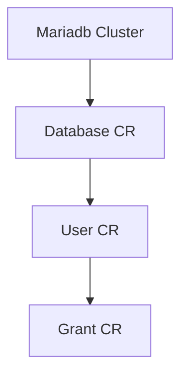
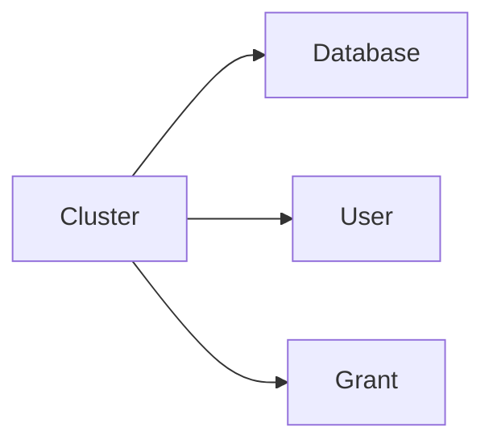
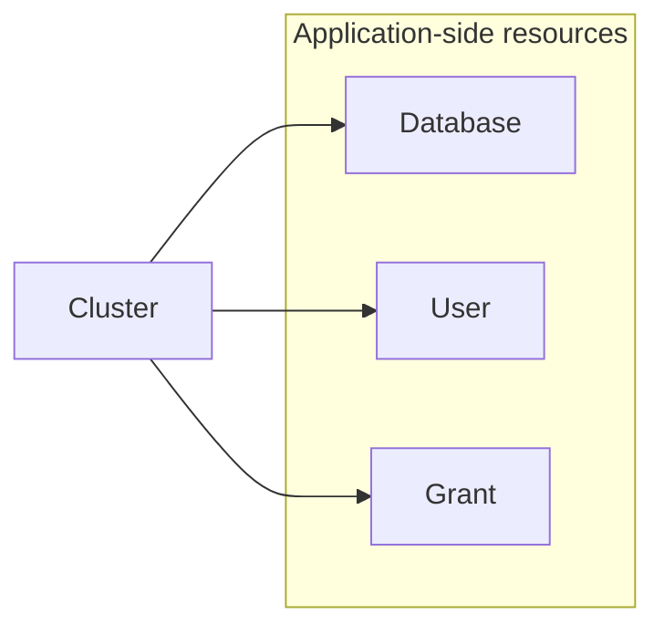
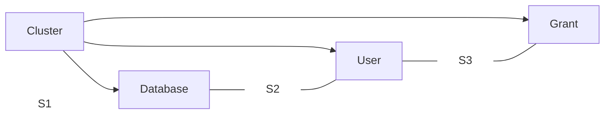
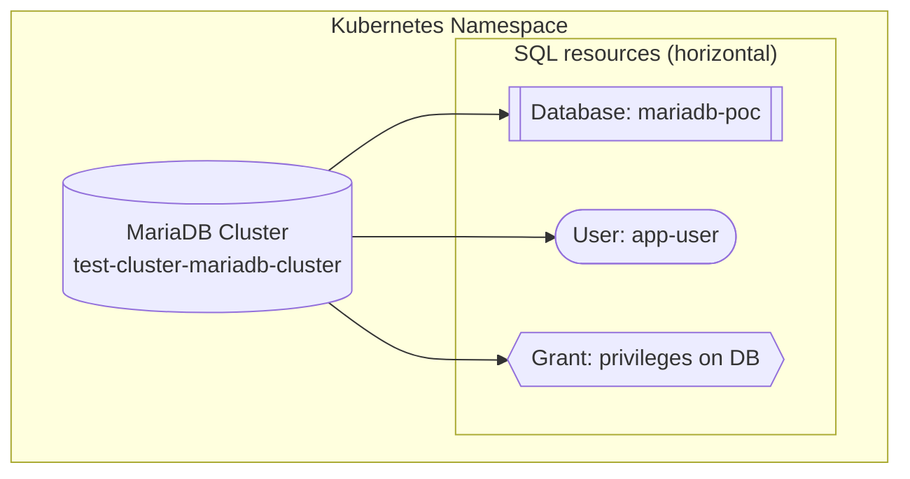
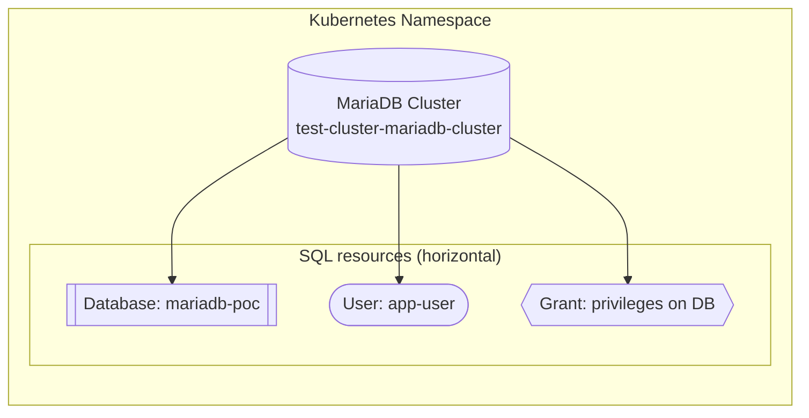
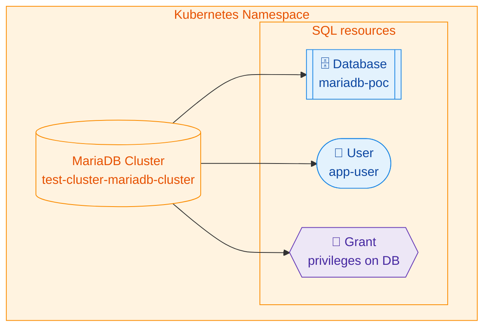

# Maria DB Operator PoC - FRLD-638

# General

## MariaDB Cluster (the MariaDB CR)
Represents the MariaDB server(s) running in Kubernetes.
It defines the pods, replication topology, storage, configuration, and high availability.
It can be think of as an enigne that runs MariaDB but doesn’t automatically create any logical databases.

## Database (the Database CR)

Represents a logical schema inside the MariaDB cluster.
It is not a separate server but rather a namespace for tables, views, etc., inside the cluster.
The operator uses the cluster’s root/admin credentials to create this schema when you apply the Database CR.
You can create many Database CRs pointing to the same cluster.

---

---


---


---


---


---



---


---


---




# Prerequisits

mariadb crds are installed in the cluster
```bash
helm repo add mariadb-operator https://helm.mariadb.com/mariadb-operator
helm install mariadb-operator-crds mariadb-operator/mariadb-operator-crds
```

# Limitations
You cannot create multiple MariaDBs in the same cluster. If, from some reason, you wish to create many MariaDBs clusters it has to be in different namespace.
        
    
# Alternative options to bitnami/maria-db

| Feature                | MariaDB Operator (Community) | MariaDB Enterprise Operator |
|------------------------|-----------------------------|-----------------------------|
| **Type**              | Kubernetes Operator         | Kubernetes Operator         |
| **License**           | Open-source                | Commercial (Enterprise)     |
| **Purpose**           | Manage MariaDB clusters in Kubernetes | Manage MariaDB Enterprise Platform in Kubernetes <br> Includes: <br> • MariaDB Enterprise Server (optimized, hardened) <br> • MaxScale (intelligent proxy) <br> • Enterprise Cluster (Galera) <br> • Backup and security features |
| **Galera Support**    | Yes (basic)                | Yes (enterprise-grade)      |
| **HA & Recovery**     | Basic                      | Advanced + automated        |
| **Backups**           | Manual or external tools   | Declarative, automated      |
| **Observability**     | Limited                    | Prometheus/Grafana          |
| **Support**           | Community only             | SLA-backed enterprise        |

 ### Using Community edition in production set up requires:

- **Deploy the Helm chart for MariaDB Operator**
- **Galera Support**
  - Supports Galera for High Availability (HA), but requires manual configuration.
- **Security and TLS**
  - We can use **cert-manager** for automated certificate management.
  - Certificate rotation is manual.
- **Observability**
  - Possible with Prometheus by deploying an additional **Prometheus Exporter** Kubernetes resource.
- **Load Balancing**
  - Does **not** include MaxScale (intelligent proxy from MariaDB).
  - Can be achieved via:
    - Kubernetes **Service**
    - **Ingress**
    - **Gateway API** (new option)
- **Backups**
  - No built-in solution, but possible options:
    - Use **mysqldump** or **mariabackup** in CronJobs.
    - Integrate with **Velero** or other Kubernetes backup tools.
- **Upgrades**
  - More complicated because it requires:
    - Draining nodes manually.
    - Upgrading pods one by one to avoid downtime.

## **Questions**
- What exactly does it mean to keep **Kyverno policies** in mind?  
  - “Not run as root” is clear, but what about others (HA, Backup, Failovers, Replication, etc.)?
- Where to test this?  

    
    
 ## Migration Plan
    https://github.com/mariadb-operator/mariadb-operator/blob/main/docs/logical_backup.md#migrating-an-external-mariadb-to-a-mariadb-running-in-kubernetes

