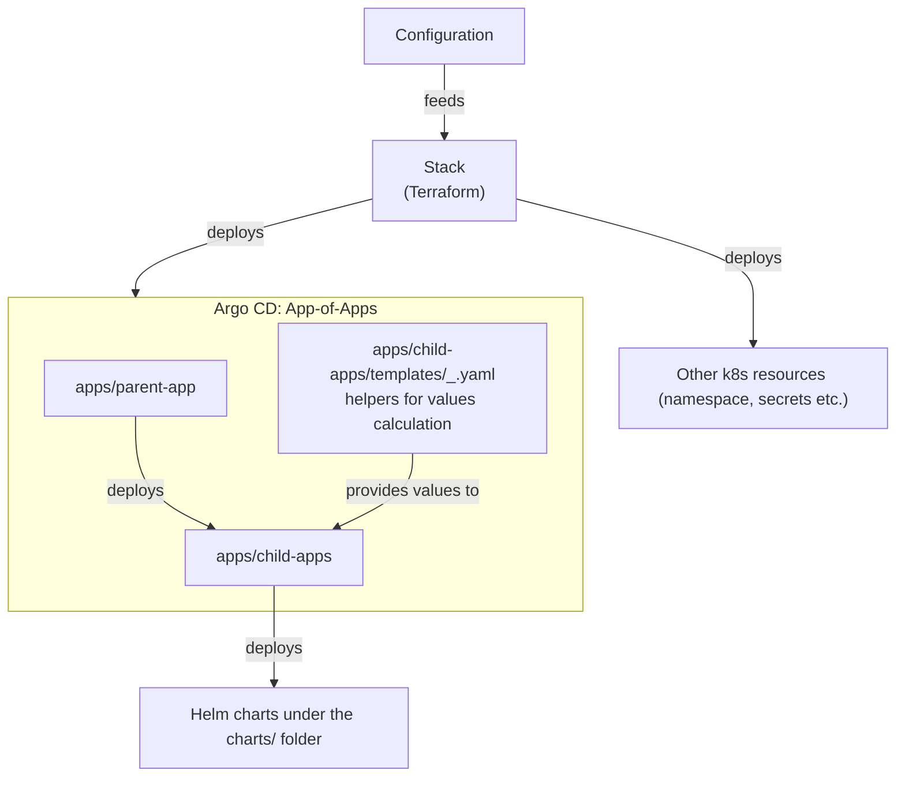

## **Overview**

This stack enables declarative management of ArgoCD **Application** resource for **MariaDB Operator** using **Terraform**. By defining it as code, we eliminate manual configuration in the ArgoCD UI, improving reliability, consistency, and repeatability.

**MariaDB Cluster (the MariaDB CR)**
Represents the MariaDB server(s) running in Kubernetes.
It defines the pods, replication topology, storage, configuration, and high availability.
It can be think of as an enigne that runs MariaDB but doesn’t automatically create any logical databases.

**Database (the Database CR)**

Represents a logical schema inside the MariaDB cluster.
It is not a separate server but rather a namespace for tables, views, etc., inside the cluster.
The operator uses the cluster’s root/admin credentials to create this schema when you apply the Database CR.
You can create many Database CRs pointing to the same cluster.

### Prerequisits

Mariadb crds must be installed once in the cluster by the administrator
```bash
helm repo add mariadb-operator https://helm.mariadb.com/mariadb-operator
helm install mariadb-operator-crds mariadb-operator/mariadb-operator-crds
```

### Usage

Once the CRDs are in place, you only need to adapt the configuration YAML file and apply the Terraform code
1. Configure variables in configurations/mariadb-operator
2. Navigate to the stack folder and perfom the deployment
    ```bash
    cd stack/mariadb-operator
    terraform init
    terraform plan
    terraform apply
    ```

## Architecture
1. Terraform provisions:
  - Argo CD Applications using the app-of-apps pattern
  - Kubernetes resources required for the database (namespace, secrets)
2. Argo CD syncs the Application and deploys MariaDB into the target namespace.

### Graphical presentation of a deployment process



## How to connect

You can connect to the running instance from within another pod that is running inside the same namespace.
Apply attached `mysql-clinet.yaml` manifest, exec into it and connect to the running DB:
```bash
kubectl apply -f mysql-clinet.yaml
kubectl exec <pod-name> -it -- bash
mysql -h <database cluter name> -u admin -p
```

Enter the admin password, which you can get as follows:
```bash
kubectl get secret admin-password -n <target-namespace> -o jsonpath="{.data.password}" | base64 --decode
```

---
## Open points
- AppProject - how to ensure it is there? deploy it together with mariadb or in seperate stack?
